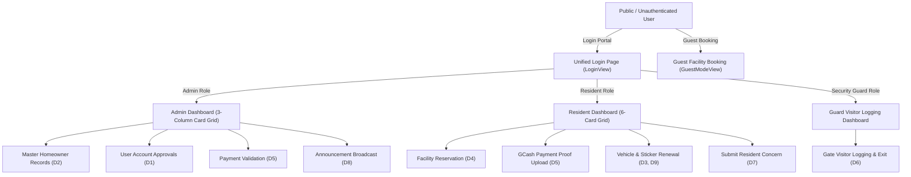

# 📋 NovaLink HOA Management System

> **System Title**: NovaLink: Web-Based HOA Management System for Novaville Homeowners Association, Inc.  
> **Deployment Target**: Production Web Server (PHP 8.x / MySQL 8.0 / React Vite Frontend)

---

## 🏗️ 1. Architecture & System Overview

NovaLink is a production-grade web application built for the **Novaville Homeowners Association, Inc. (NHAI)**. The system is designed to streamline community operations, gated entry visitor tracking, financial dues collection, facility reservations, vehicle sticker renewals, resident concerns, and real-time email notifications.



---

## 🗄️ 2. Production Data Stores (Schema Mapping D1–D10)

| Data Store | Entity | Production Function | Storage Implementation |
| :--- | :--- | :--- | :--- |
| **D1** | `users` | User Accounts (Admin, Resident, Security) | `users` table (`schema.sql`) / `localStorage` (`novalink_clean_production_v1`) |
| **D2** | `homeowners` | Homeowner Master Records & Occupants | `homeowners` & `occupants` tables |
| **D3** | `vehicles` | Resident Vehicles | `vehicles` table |
| **D4** | `reservations` | Facility Booking Requests | `facility_reservations` table |
| **D5** | `dues_payments` | Dues & GCash Payment Proofs | `dues_records` & `payment_proofs` tables |
| **D6** | `visitor_logs` | Security Gate Visitor Entries | `visitor_logs` table |
| **D7** | `concerns` | Resident Concern Tickets | `resident_concerns` table |
| **D8** | `announcements` | Board Bulletins & News | `announcements` table |
| **D9** | `sticker_renewals` | HOA Vehicle Sticker Requests | `sticker_renewals` table |
| **D10** | `email_logs` | Dispatched Email Audit Records | `email_logs` table & `EmailService.php` |

---

## 🔐 3. User Roles & Account Access

| Role | Default Primary Account | Access Rights |
| :--- | :--- | :--- |
| **Main Administrator** | `clarence@novaville.org` | Full System Control, User Account Creation/Approvals, Homeowner Records, Dues Validation, Announcement Dispatch. |
| **NHAI Administrator** | `admin@novaville.org` | System Administration & Records Management. |
| **Security Officer** | `guard@novaville.org` | Gate Visitor Entry Logging, On-Site Visitor Tracking, Exit Log Recording. |
| **Resident Homeowner** | `clarence.lagamia@gmail.com` | Facility Booking, Dues Payment Upload, Vehicle Registration, Sticker Renewal, Concern Submissions. |

---

## 📩 4. Email Notification Subsystem

NovaLink integrates an automated HTML email notification pipeline:

1. **OTP Verification**: Dispatches 4-digit verification codes for self-registration and password resets.
2. **Account Approval Alerts**: Notifies residents when their account registration is approved or rejected by the admin.
3. **Announcement Broadcasts**: Automatically emails published community announcements to active residents.
4. **Payment Receipts**: Sends validation confirmation upon proof verification by accounting.
5. **Sticker Renewals**: Dispatches approval notices containing generated sticker serial numbers (`NVL-2026-XXXX`).

---

## 🚀 5. Production Deployment Instructions

### A. Frontend Deployment (Vite / React)
```bash
# Install dependencies
npm install

# Build optimized production bundle
npm run build
```
*Outputs compiled assets to `/dist` with vendor chunk splitting (`vendor.js` & `icons.js`).*

### B. Backend API & Database Setup (PHP / MySQL)
1. Import `backend/schema.sql` into your MySQL server.
2. Configure credentials in `backend/config/database.php` and SMTP settings in `backend/config/mail.php`.
3. Deploy `/dist` files to web root (`/public_html`) and `/backend` to the server root.

---

## ✅ 6. Quality Assurance & Verification Checklist

- [x] **Direct Entry Portal**: Unauthenticated access lands directly on `LoginView.jsx`.
- [x] **Zero Mock Data**: Data stores initialized clean for fresh production launch.
- [x] **Account Name Displays**: Dynamic header greetings match logged-in account names (`Clarence Lagamia`).
- [x] **Persistent Storage**: Automatic client storage sync (`novalink_clean_production_v1`).
- [x] **Vite Bundle Optimization**: Clean build verification (`npm run build`).
