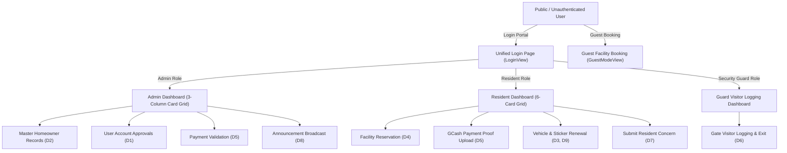

# NovaLink HOA Management System

**System Title**: NovaLink: Web-Based HOA Management System for Novaville Homeowners Association, Inc.  

**Beta Testing**: [novalink.dpdns.org](https://novalink.dpdns.org)

**Documentation Paper**: [novalinkhub.tech](https://novalinkhub.tech)

**Deployment Target**: Production Web Server (Oracle Linux / Apache / PHP 8.x / MySQL 8.0 / React Vite Frontend)

---

## 1. Architecture & System Overview

NovaLink is a production-grade web application built for the Novaville Homeowners Association, Inc. (NHAI). The system is designed to streamline community operations, gated entry visitor tracking, financial dues collection, facility reservations, vehicle sticker renewals, resident concerns, and real-time email notifications.



---

## 2. Production Data Stores (Schema Mapping D1-D10)

| Data Store | Entity | Production Function | Storage Implementation |
| :--- | :--- | :--- | :--- |
| **D1** | `users` | User Accounts (Admin, Resident, Security) | `users` table (`schema.sql`) / `localStorage` (`novalink_clean_production_v1`) |
| **D2** | `homeowners` | Homeowner Master Records & Occupants | `homeowners` & `occupants` tables |
| **D3** | `vehicles` | Resident Vehicles | `vehicles` table |
| **D4** | `reservations` | Facility Booking Requests | `facility_reservations` table |
| **D5** | `dues_payments` | Dues & GCash Payment Proofs | `dues_records` & `payment_proofs` tables |
| **D6** | `visitor_logs` | Security Gate Visitor Entries | `visitor_logs` table |
| **D7** | `concerns` | Resident Concern Tickets | `resident_concerns` table |
| **D8** | `announcements` | Board Bulletins & News | `announcements` table |
| **D9** | `sticker_renewals` | HOA Vehicle Sticker Requests | `sticker_renewals` table |
| **D10** | `email_logs` | Dispatched Email Audit Records | `email_logs` table & `EmailService.php` |

---

## 3. User Roles & Account Access

| Role | Default Primary Account | Access Rights |
| :--- | :--- | :--- |
| **Main Administrator** | `clarence@novalinkhub.tech` | Full System Control, User Account Creation/Approvals, Homeowner Records, Dues Validation, Announcement Dispatch. |
| **NHAI Administrator** | `admin@novalinkhub.tech` | System Administration & Records Management. |
| **Security Officer** | `guard@novalinkhub.tech` | Gate Visitor Entry Logging, On-Site Visitor Tracking, Exit Log Recording. |
| **Resident Homeowner** | `clarence.lagamia@gmail.com` | Facility Booking, Dues Payment Upload, Vehicle Registration, Sticker Renewal, Concern Submissions. |

---

## 4. Email Notification Subsystem

NovaLink integrates an automated HTML email notification pipeline utilizing the Brevo v3 API:

1. **OTP Verification**: Dispatches 4-digit verification codes for self-registration and password resets.
2. **Account Approval Alerts**: Notifies residents when their account registration is approved or rejected by the admin.
3. **Announcement Broadcasts**: Automatically emails published community announcements to active residents.
4. **Payment Receipts**: Sends validation confirmation upon proof verification by accounting.
5. **Sticker Renewals**: Dispatches approval notices containing generated sticker serial numbers.
6. **Guest Reservations**: Dispatches verification codes and reservation confirmations for non-resident guests.

---

## 5. Production Deployment Instructions (Oracle Cloud / Apache)

### A. Frontend Deployment (Vite / React)
```bash
# Install dependencies
npm install

# Build optimized production bundle
npm run build
```
*Outputs compiled assets to `/dist` with vendor chunk splitting (`vendor.js` & `icons.js`).*

### B. Backend API & Database Setup (PHP / MariaDB)
1. Install Apache, PHP, and MariaDB on the target server.
2. Import `backend/schema.sql` into the MariaDB server.
3. Create a `backend/config/env.php` file on the server and configure the `DB_PASS`, `SYSTEM_EMAIL`, and `BREVO_API_KEY` credentials (do not commit this file to version control).
4. Deploy the contents of the `/dist` folder and the `/backend` folder to the web root (`/var/www/html/`).
5. Configure the Apache VirtualHost and an `.htaccess` file to rewrite non-API requests to `index.html`.

---

## 6. Quality Assurance & Verification Checklist

- [x] **Direct Entry Portal**: Unauthenticated access lands directly on `LoginView.jsx`.
- [x] **Secure API Credentials**: Brevo API keys and database credentials extracted to `env.php` and ignored by Git.
- [x] **Live Email Dispatch**: PHP cURL integration with Brevo REST API verified.
- [x] **Account Name Displays**: Dynamic header greetings match logged-in account names.
- [x] **Persistent Storage**: Automatic client storage sync (`novalink_clean_production_v1`).
- [x] **Vite Bundle Optimization**: Clean build verification (`npm run build`).

---

## 7. CI/CD Pipeline (GitHub Actions)

NovaLink uses GitHub Actions to automatically build and deploy to the Oracle server:
1. Pushing to the `main` branch triggers the `.github/workflows/deploy.yml` workflow.
2. The runner executes `npm install` and `npm run build`.
3. The runner securely SCP/rsyncs the `dist/` and `backend/` folders to `/var/www/html/novalink/` on the Oracle server.
4. *Note: `backend/config/env.php` is explicitly excluded to preserve live database credentials.*
